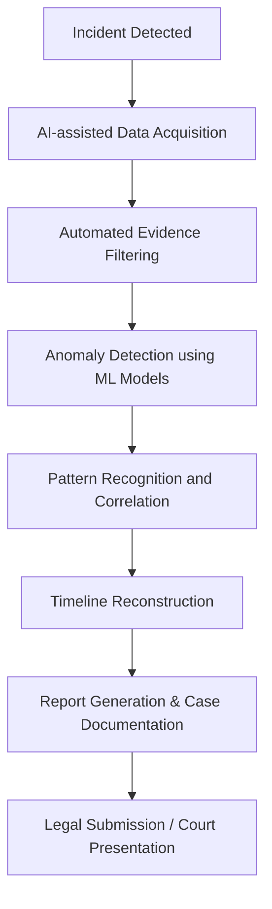

# The Role of Artificial Intelligence in Cyber Crime Investigation and Digital Forensics

**Author:** Shamlaan Sayyed  
**Date:** October 2025  
**Course:** Cyber Crime Investigation & Digital Forensics  
**Self-Learning Based On:** TryHackMe – Web Fundamentals & Jr Penetration Tester  

---

## Introduction

With the exponential growth of technology, cybercrime has become increasingly sophisticated and global. Investigators face new challenges in collecting, analyzing, and correlating vast amounts of digital evidence.  
To combat this, Artificial Intelligence (AI) and Machine Learning (ML) have emerged as powerful allies in Cyber Crime Investigation and Digital Forensics.

AI can automate repetitive forensic tasks, identify hidden patterns, detect anomalies, and even predict potential attacks. These capabilities not only accelerate investigations but also improve accuracy, enabling experts to focus on complex analytical and legal aspects.

---

## How AI Supports Cyber Crime Investigations

AI contributes to cyber investigations through several key areas:

### 1. Automated Evidence Collection
Digital forensic tools powered by AI can automatically scan systems, logs, and networks for evidence.  
Natural Language Processing (NLP) can even extract information from unstructured data such as chat logs or emails.

### 2. Anomaly and Intrusion Detection
AI algorithms, especially Machine Learning classifiers, help detect anomalies in traffic or user behavior.  
For example:
- Unusual login patterns  
- Suspicious IP activity  
- Abnormal data transfers  

These are flagged by AI models, alerting investigators in real time.

### 3. Malware Classification
Using deep learning models such as Convolutional Neural Networks (CNNs), AI can classify malware families by analyzing binary patterns or opcode sequences — saving hours of manual analysis.

### 4. Digital Evidence Correlation
AI assists in correlating data from multiple sources — social media, network logs, financial records — to uncover links between suspects, devices, and activities.

### 5. Predictive Analysis
Predictive models can anticipate potential cyberattacks based on existing data trends.  
For instance, AI may forecast phishing campaigns or DDoS patterns before they fully evolve.

---

## AI in Digital Forensics Workflow

The integration of AI enhances each phase of the forensic process — from evidence acquisition to reporting.  
Below is a simplified flowchart describing how AI fits into a typical digital forensics investigation pipeline.

Diagram Explanation:  
- The process starts with incident detection.  
- AI automates evidence acquisition, filtering, and anomaly detection.  
- Machine learning models correlate data to reconstruct events.  
- Finally, automated reporting tools generate detailed forensic reports for legal use.

---

## AI Tools and Techniques Used in Forensics

| Tool/Technique | Description | Application |
|----------------|--------------|-------------|
| Machine Learning (ML) | Supervised/unsupervised models trained on past incidents | Intrusion detection, behavioral analysis |
| Natural Language Processing (NLP) | Understanding human language | Analyzing messages, logs, or dark web content |
| Deep Learning (DL) | Neural networks for image/code recognition | Malware detection, file analysis |
| AI-Powered SIEMs | Security Information and Event Management tools | Real-time threat monitoring and correlation |
| Graph Analysis | Relationship mapping | Linking suspects and digital entities |

---

## Real-World Applications

1. **Law Enforcement:** AI systems like IBM Watson for Cybersecurity assist agencies in analyzing case evidence and generating leads.  
2. **Financial Sector:** Banks use AI-based fraud detection systems to flag unusual transactions in real time.  
3. **Dark Web Monitoring:** AI crawlers and NLP models analyze marketplaces for illegal activities, detecting keywords and vendor relationships.

---

## Challenges in Using AI for Forensics

Despite its advantages, AI also introduces new challenges:

- Data Bias: ML models depend on quality datasets — biased data can mislead investigations.  
- Explainability: AI “black box” decisions can be difficult to justify in court.  
- Adversarial Attacks: Criminals may manipulate AI systems with poisoned data.  
- Legal and Ethical Issues: Privacy and consent in automated surveillance remain gray areas.

---

## Future Outlook

The future of digital forensics lies in AI-Driven Autonomous Investigation Systems, capable of:
- Self-learning from previous incidents  
- Generating automated chain-of-custody reports  
- Collaborating with human investigators for decision support  

Integration of Quantum Computing with AI may revolutionize evidence decryption and complex pattern recognition in the next decade.

---

## Conclusion

AI is transforming the field of Cyber Crime Investigation and Digital Forensics from manual, time-consuming analysis to intelligent, automated processes.  
By combining AI with human expertise, investigators can uncover complex cybercrimes faster and more accurately than ever before.

However, ethical deployment, legal accountability, and transparency in AI decision-making must remain priorities to ensure justice and trust in digital forensics.

---

## References

- TryHackMe – Web Fundamentals  
- TryHackMe – Jr Penetration Tester Path  
- NIST Digital Forensics Framework  
- Europol AI in Digital Forensics Report (2024)  
- IBM Watson Cybersecurity Research Papers  

---

*Created as part of the “Cyber Crime Investigation & Digital Forensics” course activity.*
